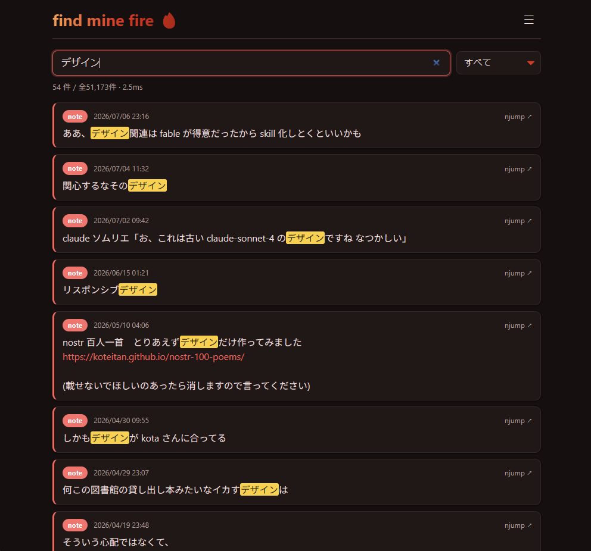

[Japanese](README.md) | [English](README-en.md)

# find mine fire 🔥

**自分の** nostr の `kind:1` / `kind:6` をリモートリレーからローカルの
strfry リレーへ収集し、**SQLite (FTS5) で爆速インクリメンタルサーチ**する
**ubuntu 用ローカルツール**です。**ローカルサーバー or CLI** で動きます。

取得元の **npub とリレーは引数で指定**する（**必須**。指定が無いとエラー）。



## 仕組み
- **同期**: NIP-77 Negentropy (`strfry sync`)。差分だけを効率的に取得し rate limit を実質回避。
- **strfry**: ネイティブの `strfry` が PATH にあればそれを、無ければ Docker (`dockurr/strfry`) を使用。
- **検索**: イベントを `web/events.sqlite`(FTS5 trigram) に索引化し、ブラウザの sqlite-wasm で検索。

## ファイル
| file | 役割 |
|------|------|
| `lib.sh` | 共通処理（npub→hex デコード / フィルタ生成 / strfry ランナー） |
| `strfry.conf` | ローカルリレー設定（DB=`./strfry-db/`, port 7777） |
| `sync.sh` | リモート → ローカル DB へ Negentropy 同期 |
| `build-db.sh` / `build-db.py` | ローカル DB → `web/events.sqlite` (FTS5) を生成 |
| `stats.sh` / `stats.py` | 収集イベントの統計を表示 |
| `findmine` | ターミナル上でインクリメンタルサーチする CLI |
| `run-relay.sh` | ローカルリレー(ws://localhost:7777)を起動して配信 |
| `web/` | 検索ページ（`index.html` / `style.css` / `vendor/` sqlite-wasm） |

## 使い方
```bash
# 1) 収集（npub と 1つ以上のリレーを引数で指定。複数指定で順に巡回）
./sync.sh npub1f3w4x7... wss://x.kojira.io wss://yabu.me wss://relay.damus.io

# 2) 統計
./stats.sh npub1f3w4x7...

# 3) 検索インデックスを生成
./build-db.sh npub1f3w4x7...

# 4a) ブラウザで検索: web/ をローカル HTTP サーバで配信して index.html を開く
#     （file:// では sqlite の fetch が失敗するので必ず HTTP 経由。8000/8080 以外）

# 4b) ターミナルで検索（CLI）
./findmine                 # インクリメンタルサーチ（↑↓移動 / Enter で njump / Esc 終了）
./findmine 攻殻            # ワンショット検索（引数やパイプ時）
./findmine 殻 --url --kind 1   # njump URL 付き / kind で絞り込み

# ローカルリレーとして配信したい場合
./run-relay.sh
```
`findmine` は `build-db.sh` が作った `web/events.sqlite` を検索する（TTY なら対話 TUI、
引数やパイプならワンショット出力）。
npub / リレーの指定が無い場合はエラー終了する（組み込みのデフォルトは無し）。
npub の代わりに hex の pubkey をそのまま渡してもよい。

### 環境変数
- `SYNC_DIR=down|up|both` … 同期方向（既定 down）
- `KINDS_DEFAULT=1,6` … 収集する kind
- `SOURCE_RELAY` … リレー引数が無いときにのみ使われる
- `FORCE_DOCKER=1` … ネイティブ strfry があっても Docker を使う

## 検索の挙動
- 3文字以上: FTS5 trigram 索引で検索（数ms・日本語OK）
- 1〜2文字: LIKE スキャンにフォールバック
- kind:1 / kind:6 で絞り込み、各結果から njump へリンク
- `web/vendor/sqlite3.{mjs,wasm}` は FTS5 有効な公式 sqlite-wasm を同梱（オフライン動作）

## メモ
- リレーの rate limit は NIP-11 で確認: `curl -H "Accept: application/nostr+json" <https-url>`
- `strfry.conf` の `rejectEventsOlderThanSeconds` は 100 年に設定済み
  （既定の3年だと `strfry sync` が3年より古い投稿を静かに捨てるため）
- `strfry-db/`（生の LMDB）と `web/events.sqlite`（生成物）は git 管理外。
  GitHub Pages 等で配信する場合は `git add -f web/events.sqlite` でデータも含める。
